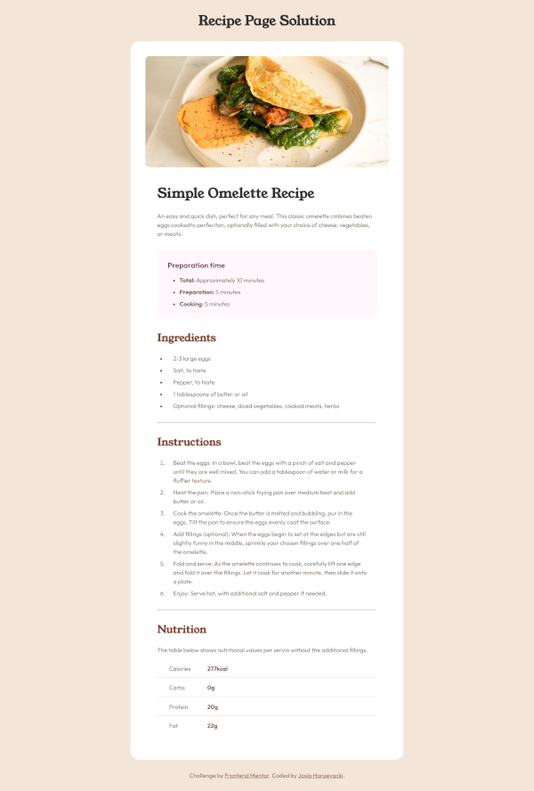

# Frontend Mentor - Recipe page solution

This is a solution to the [Recipe page challenge on Frontend Mentor](https://www.frontendmentor.io/challenges/recipe-page-KiTsR8QQKm). Frontend Mentor challenges help you improve your coding skills by building realistic projects. 

## Table of contents

- [Overview](#overview)
  - [Screenshot](#screenshot)
  - [Links](#links)
- [My process](#my-process)
  - [Built with](#built-with)
  - [What I learned](#what-i-learned)
  - [Useful resources](#useful-resources)
- [Author](#author)

## Overview

### Screenshot




### Links

- Solution URL: [GitHub](https://github.com/josip-h/recipe-page)
- Live Site URL: [GitHub Pages](https://josip-h.github.io/recipe-page/)

## My process

### Built with

- Semantic HTML5 markup
- CSS
- Flexbox
- Mobile-first workflow
- BEM

**Note: These are just examples. Delete this note and replace the list above with your own choices**

### What I learned

1. How to change the color of list markers (bullets, numbers, ...) by using the ```li::marker``` pseudoselector. For example if we have some list like this one:

    ```html
    <ul>
        <li></li>
        <li></li>
        <li></li>
        ...
    </ul>
    ```
    To change the color of bullets to a value of "new-color" in CSS stylesheet we would write:

    ```css
    ul li::marker {
        color: "new-color";
    }
    ```
2. How to target all children of a parent except last child by using the :not selector in combination with :last-child pseudoselector. Again on the example of a list from the example above we would write:

    ```css
    .parent-selector > :not(:last-child) {
        ...
    }
    ```

### Useful resources

- [How to change bullet color of lists](https://www.w3schools.com/howto/howto_css_bullet_color.asp)
- [How to use :last-child pseudoselector](https://www.w3schools.com/cssref/sel_last-child.php#gsc.tab=0)
- [How to use :not pseudoselector](https://www.w3schools.com/cssref/sel_not.php)

## Author

- Website - [Josip Hanzevacki](https://github.com/josip-h)
- Frontend Mentor - [@josip-h](https://www.frontendmentor.io/profile/josip-h)